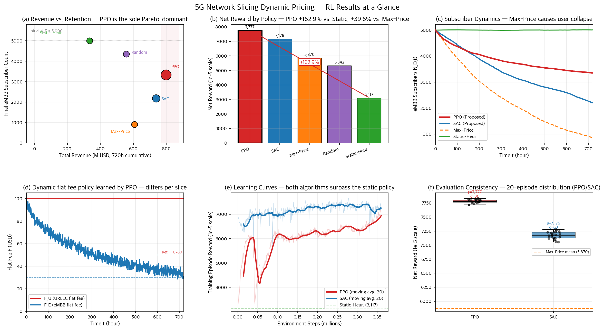

# Networking-Price

Reinforcement learning for **dynamic pricing in 5G network slicing** (URLLC + eMBB).
A subscription-based MDP is solved with PPO and SAC, then compared against three non-RL baselines.

Repository: <https://github.com/Ryu-Jemu/network-pricing>

---

## 1. Project logic

### Environment — [`env/network_slicing_env.py`](env/network_slicing_env.py)

A Gymnasium env with two slices (URLLC=0, eMBB=1) and a 720-step episode (1 hour per step ≈ 30 days).

| | |
|---|---|
| **State** | $(N_U,\ N_E,\ \eta_U^{\text{prev}},\ \eta_E^{\text{prev}})$ — current subscribers + previous QoS, normalized |
| **Action** | $(F_U,\ p_U,\ F_E,\ p_E) \in [0,1]^4$, scaled inside `step()` to flat fee $F$ and per-unit price $p$ |
| **Reward** | $(\text{Revenue} - \text{Penalty}) \times 10^{-5}$ |

Each `step()` runs four phases that mirror the model spec (F1–F11):

1. **Departure** — $P_{\text{dep}} = \sigma(\gamma_0 + \gamma_F \tilde{F} + \gamma_p \tilde{p} - \gamma_\eta\, \eta_{\text{prev}})$, sampled per-user (Binomial).
2. **Arrival** — $P_{\text{arr}} = \sigma(\beta_0 - \beta_F \tilde{F} - \beta_p \tilde{p})$, new users sampled (Poisson with $\lambda = \lambda_{\max} P_{\text{arr}}$).
3. **Billing & QoS** — usage $q \sim \mathrm{LogNormal}(\mu_s, \sigma_s^2)$; bill $B = F_s + \max(0,\ q - \bar{Q}_s)\, p_s$; QoS $\eta_s \sim \mathcal{U}(\eta_{\text{low}}, \eta_{\text{high}})$ (exogenous).
4. **Reward** — $\text{Penalty} = \sum_s w_s\, N_s^{\text{active}}\, \max(0,\ \eta_s^{\text{tgt}} - \eta_s)$; reward $=$ revenue $-$ penalty (scaled).

All numerical parameters live in `ENV_CONFIG` of [`train/config.py`](train/config.py) and are sanity-checked by [`tests/test_env.py`](tests/test_env.py) (LogNormal moments, departure/arrival probabilities, expected bill, full-episode stability).

### Why this is non-trivial

Raising prices increases per-user revenue but also increases churn and reduces arrivals. A static "always charge the reference price" policy leaves money on the table; a "max price" policy collapses the eMBB subscriber base. The agent must learn the trade-off **per slice** and **per subscriber state**.

---

## 2. Training method

### Algorithms — [`train/train_sac.py`](train/train_sac.py), [`train/train_ppo.py`](train/train_ppo.py)

Both use Stable-Baselines3 with an MLP policy `[256, 256, 256]`, $\text{lr}=3\times 10^{-4}$, $\gamma=0.99$, $\text{seed}=42$.

| | SAC | PPO |
|---|---|---|
| Episodes | 500 | 500 |
| Off/On-policy | off-policy, replay buffer 1M | on-policy, GAE $\lambda=0.95$, clip $0.2$ |
| Batch | 256 | 64 ($\times 10$ epochs) |

Training loop (same for both):

1. Wrap `NetworkSlicingEnv` in SB3 `Monitor`.
2. Run `model.learn(total_timesteps = episodes × 720)` with an `EpisodeLogCallback` that records the episodic return.
3. Save the model to `experiments/models/`.
4. **Evaluate** the *deterministic* policy on **20 fresh episodes** (`seeds = 42…61`), recording reward, revenue, penalty, and final subscriber counts. Results go to `experiments/results/{algo}_seed42.json`.

### Baselines — [`train/baselines.py`](train/baselines.py)

Three fixed policies are evaluated with the same 20-episode protocol:

- **Static-Heuristic** — always reference prices `[0.5, 0.5, 0.3, 0.25]`
- **Random** — `Uniform(0,1)⁴`
- **Max-Price** — `[1, 1, 1, 1]` (`F=100, p=20` on both slices)

---

## 3. Results



Mean over 20 evaluation episodes (reward is the env-internal `×1e-5` scaled value).

| Policy | Reward ↑ | Revenue (USD) | Final $N_U$ | Final $N_E$ |
|---|---:|---:|---:|---:|
| **PPO**          | **7,777** | **798.6 M** | 938   | **3,344** |
| **SAC**          | 7,176     | 738.5 M     | 990   | 2,188     |
| Max-Price        | 5,870     | 606.3 M     | 921   | 909       |
| Random           | 5,342     | 556.4 M     | 1,003 | 4,358     |
| Static-Heuristic | 3,117     | 334.3 M     | 1,006 | 5,003     |

- **PPO is +149.5 % over Static-Heuristic and +32.5 % over Max-Price.**
- Max-Price looks competitive on revenue alone but **collapses the eMBB base from 5,000 → 909**, which is unsustainable.
- A ~20 M USD penalty floor exists for *every* policy because URLLC QoS is exogenous (target 0.99999 is rarely met).
- Raw JSON: [`experiments/results/`](experiments/results/). Plots: [`experiments/figures/`](experiments/figures/) — see [`experiments/figures/README.md`](experiments/figures/README.md) for the figure-by-figure walkthrough.

---

## 4. Reproduce

```bash
pip install gymnasium numpy scipy matplotlib stable-baselines3[extra]

python3 tests/test_env.py        # ~30 s, sanity-checks the env
python3 train/baselines.py       # ~1 min, writes baselines.json
python3 train/train_sac.py       # SAC train + 20-ep eval
python3 train/train_ppo.py       # PPO train + 20-ep eval
python3 experiments/make_figures.py   # 4 PNGs in experiments/figures/
```

---

## 5. Limitations

- Single seed ($\text{seed}=42$); multi-seed sweep is defined in `EVAL_CONFIG["seeds"]` but not yet run. Statistical significance of inter-algorithm differences is unverified.
- Environment parameter coefficients are set to produce qualitatively realistic behavior (e.g., ~1.5% monthly churn at reference prices) rather than calibrated from measured data. Sensitivity analysis is left as future work.
- QoS $\eta$ is exogenous, so the policy cannot reduce the URLLC penalty floor. A joint pricing + resource-allocation extension is left as future work.
- Only two slices (URLLC, eMBB); no mMTC.
